### Questions
* Why is there a difference between population statistics and sample statistics? 
    * Ex: sd den -> pop (n) and sample (n-1)

### Objectives
YWBAT
* create a column of data in a dataframe using pandas
* create a column of data in a dataframe using pandas functions such as apply, map, applymap
* locate specific parts of a dataframe using iloc/loc


### Keyterms
* D.R.Y. Code - Do Not Repeat Yourself

### Outline


```python
import pandas as pd
import numpy as np

from sklearn.datasets import load_iris

import matplotlib.pyplot as plt
import seaborn as sns
```


```python
iris = load_iris()
```


```python
data = iris.data
labels = iris.target
columns = iris.feature_names
```


```python
df = pd.DataFrame(data, columns=columns)
df['label'] = labels
df.head()
```


<div>
<style scoped>
    .dataframe tbody tr th:only-of-type {
        vertical-align: middle;
    }

    .dataframe tbody tr th {
        vertical-align: top;
    }

    .dataframe thead th {
        text-align: right;
    }
</style>
<table border="1" class="dataframe">
  <thead>
    <tr style="text-align: right;">
      <th></th>
      <th>sepal length (cm)</th>
      <th>sepal width (cm)</th>
      <th>petal length (cm)</th>
      <th>petal width (cm)</th>
      <th>label</th>
    </tr>
  </thead>
  <tbody>
    <tr>
      <td>0</td>
      <td>5.1</td>
      <td>3.5</td>
      <td>1.4</td>
      <td>0.2</td>
      <td>0</td>
    </tr>
    <tr>
      <td>1</td>
      <td>4.9</td>
      <td>3.0</td>
      <td>1.4</td>
      <td>0.2</td>
      <td>0</td>
    </tr>
    <tr>
      <td>2</td>
      <td>4.7</td>
      <td>3.2</td>
      <td>1.3</td>
      <td>0.2</td>
      <td>0</td>
    </tr>
    <tr>
      <td>3</td>
      <td>4.6</td>
      <td>3.1</td>
      <td>1.5</td>
      <td>0.2</td>
      <td>0</td>
    </tr>
    <tr>
      <td>4</td>
      <td>5.0</td>
      <td>3.6</td>
      <td>1.4</td>
      <td>0.2</td>
      <td>0</td>
    </tr>
  </tbody>
</table>
</div>


```python
type(df.columns), df.columns
```


    (pandas.core.indexes.base.Index,
     Index(['sepal length (cm)', 'sepal width (cm)', 'petal length (cm)',
            'petal width (cm)', 'label'],
           dtype='object'))


```python
# Let's rename our columns
# remove the (cm)
# add an underscore between all the words

df.columns = df.columns.str.replace("\(cm\)", "").str.strip().str.replace(" ", "_")
```


```python
df.head()
```


<div>
<style scoped>
    .dataframe tbody tr th:only-of-type {
        vertical-align: middle;
    }

    .dataframe tbody tr th {
        vertical-align: top;
    }

    .dataframe thead th {
        text-align: right;
    }
</style>
<table border="1" class="dataframe">
  <thead>
    <tr style="text-align: right;">
      <th></th>
      <th>sepal_length</th>
      <th>sepal_width</th>
      <th>petal_length</th>
      <th>petal_width</th>
      <th>label</th>
    </tr>
  </thead>
  <tbody>
    <tr>
      <td>0</td>
      <td>5.1</td>
      <td>3.5</td>
      <td>1.4</td>
      <td>0.2</td>
      <td>0</td>
    </tr>
    <tr>
      <td>1</td>
      <td>4.9</td>
      <td>3.0</td>
      <td>1.4</td>
      <td>0.2</td>
      <td>0</td>
    </tr>
    <tr>
      <td>2</td>
      <td>4.7</td>
      <td>3.2</td>
      <td>1.3</td>
      <td>0.2</td>
      <td>0</td>
    </tr>
    <tr>
      <td>3</td>
      <td>4.6</td>
      <td>3.1</td>
      <td>1.5</td>
      <td>0.2</td>
      <td>0</td>
    </tr>
    <tr>
      <td>4</td>
      <td>5.0</td>
      <td>3.6</td>
      <td>1.4</td>
      <td>0.2</td>
      <td>0</td>
    </tr>
  </tbody>
</table>
</div>


```python
# Create a new column 'sepl_sepw_ratio' = sepal_length / sepal_width
# i want this rounded to 2 decimal places

df['sepl_sepw_ratio'] = np.round(df['sepal_length'] / df['sepal_width'], 2)
df.head()
```


<div>
<style scoped>
    .dataframe tbody tr th:only-of-type {
        vertical-align: middle;
    }

    .dataframe tbody tr th {
        vertical-align: top;
    }

    .dataframe thead th {
        text-align: right;
    }
</style>
<table border="1" class="dataframe">
  <thead>
    <tr style="text-align: right;">
      <th></th>
      <th>sepal_length</th>
      <th>sepal_width</th>
      <th>petal_length</th>
      <th>petal_width</th>
      <th>label</th>
      <th>sepl_sepw_ratio</th>
    </tr>
  </thead>
  <tbody>
    <tr>
      <td>0</td>
      <td>5.1</td>
      <td>3.5</td>
      <td>1.4</td>
      <td>0.2</td>
      <td>0</td>
      <td>1.46</td>
    </tr>
    <tr>
      <td>1</td>
      <td>4.9</td>
      <td>3.0</td>
      <td>1.4</td>
      <td>0.2</td>
      <td>0</td>
      <td>1.63</td>
    </tr>
    <tr>
      <td>2</td>
      <td>4.7</td>
      <td>3.2</td>
      <td>1.3</td>
      <td>0.2</td>
      <td>0</td>
      <td>1.47</td>
    </tr>
    <tr>
      <td>3</td>
      <td>4.6</td>
      <td>3.1</td>
      <td>1.5</td>
      <td>0.2</td>
      <td>0</td>
      <td>1.48</td>
    </tr>
    <tr>
      <td>4</td>
      <td>5.0</td>
      <td>3.6</td>
      <td>1.4</td>
      <td>0.2</td>
      <td>0</td>
      <td>1.39</td>
    </tr>
  </tbody>
</table>
</div>


```python
# create a new column that is the distance from the petal_width to max petal_width
# petl_from_max

df['petl_from_max'] = np.abs(df['petal_width'].max() - df['petal_width'])
```


```python
df.head()
```


<div>
<style scoped>
    .dataframe tbody tr th:only-of-type {
        vertical-align: middle;
    }

    .dataframe tbody tr th {
        vertical-align: top;
    }

    .dataframe thead th {
        text-align: right;
    }
</style>
<table border="1" class="dataframe">
  <thead>
    <tr style="text-align: right;">
      <th></th>
      <th>sepal_length</th>
      <th>sepal_width</th>
      <th>petal_length</th>
      <th>petal_width</th>
      <th>label</th>
      <th>sepl_sepw_ratio</th>
      <th>petl_from_max</th>
    </tr>
  </thead>
  <tbody>
    <tr>
      <td>0</td>
      <td>5.1</td>
      <td>3.5</td>
      <td>1.4</td>
      <td>0.2</td>
      <td>0</td>
      <td>1.46</td>
      <td>2.3</td>
    </tr>
    <tr>
      <td>1</td>
      <td>4.9</td>
      <td>3.0</td>
      <td>1.4</td>
      <td>0.2</td>
      <td>0</td>
      <td>1.63</td>
      <td>2.3</td>
    </tr>
    <tr>
      <td>2</td>
      <td>4.7</td>
      <td>3.2</td>
      <td>1.3</td>
      <td>0.2</td>
      <td>0</td>
      <td>1.47</td>
      <td>2.3</td>
    </tr>
    <tr>
      <td>3</td>
      <td>4.6</td>
      <td>3.1</td>
      <td>1.5</td>
      <td>0.2</td>
      <td>0</td>
      <td>1.48</td>
      <td>2.3</td>
    </tr>
    <tr>
      <td>4</td>
      <td>5.0</td>
      <td>3.6</td>
      <td>1.4</td>
      <td>0.2</td>
      <td>0</td>
      <td>1.39</td>
      <td>2.3</td>
    </tr>
  </tbody>
</table>
</div>


```python
# Let's look at our data
# Let's build some Histograms!!!!!!!


def plot_hist(df, column, figsize=(8, 5), bins=20):
    plt.figure(figsize=figsize)
    plt.grid(linestyle='dashed', zorder=0)
    fontsize=14
    plt.hist(df[column], color='purple', bins=bins, alpha=0.8, zorder=2)
    plt.title(column.replace("_", " ").title(), fontsize=fontsize)
    plt.xlabel("Values", fontsize=fontsize)
    plt.ylabel("Counts", fontsize=fontsize)
    plt.show()
```


```python
df.shape
```


    (150, 7)


```python
some_data = np.random.normal(20, 5, 150)
some_data
```


    array([17.12071604, 25.66580934, 20.62274247, 22.13662722, 16.93874946,
           18.73285555, 20.66639603, 15.29025398, 18.31811318, 25.47233099,
           21.38555069, 16.86060351, 14.32418648, 24.67723333, 18.15569424,
           22.36864255, 34.1931317 , 14.75851764,  7.85792136, 15.16393806,
           12.89682151, 11.16897659, 27.76268123, 17.0633767 , 23.56333961,
           27.88690094, 15.6278967 , 25.60252529, 14.08364621, 21.00138143,
           14.05005119, 16.3468268 , 14.98523391, 27.70406212, 16.28772932,
            9.05960136, 25.74483468, 22.60323419, 13.69974119, 25.36529523,
           30.03182255, 15.36772373, 19.10536594, 17.00740858, 19.55396585,
           20.44495147, 23.25889255,  7.12289569, 17.76076908, 15.91177918,
            9.32291176, 20.47000031, 21.74930464, 26.88539713, 26.60418612,
           21.20031571, 18.55341498, 20.14924666, 21.83299833,  4.10371233,
           21.29368581, 11.48449202, 26.82574847, 24.06483939, 31.21907099,
           21.3324146 , 20.70316003, 25.24820681, 18.33150112, 17.43572754,
           19.69470505, 16.31077106, 14.88687521, 23.99395978,  9.7300472 ,
           22.47239155, 19.71311865, 20.18807727, 22.67338647, 14.16762698,
           19.65756619, 22.72870661, 29.83788399, 24.30000938, 19.345078  ,
           15.55016174, 19.63545956, 10.00989956, 21.88362131, 21.07277224,
           20.9175943 , 16.85948572, 19.05921125, 23.87007063, 25.90687668,
           21.28752122, 18.64225914, 24.0889647 , 26.04479408, 19.83684987,
           21.24091847, 16.83913638, 11.82795912, 19.8891035 , 18.68596058,
           24.51500789, 22.83444203, 17.78236918, 15.38237031, 28.82135425,
           25.67963225, 22.8256646 , 13.17021978, 15.88143829, 11.4623363 ,
           16.94229391, 22.72244887, 22.44235592, 23.10221242, 16.62896631,
           10.26710871, 28.11094092, 17.28143249, 19.60732612, 25.87905725,
           16.31944619, 14.83035556, 24.04772712, 18.32690786, 19.78157802,
           20.32769201, 14.01278902, 19.73101   , 16.45324883, 14.28875211,
           26.65687802, 21.41508216, 10.64133234, 15.59940977, 16.08675365,
           19.51245886, 16.64832203,  9.53444508, 11.02701469, 20.19547133,
           24.12383228, 22.42630429, 25.83018767, 21.87317536, 23.29831031])


```python
some_data > 20
```


    array([False,  True,  True,  True, False, False,  True, False, False,
            True,  True, False, False,  True, False,  True,  True, False,
           False, False, False, False,  True, False,  True,  True, False,
            True, False,  True, False, False, False,  True, False, False,
            True,  True, False,  True,  True, False, False, False, False,
            True,  True, False, False, False, False,  True,  True,  True,
            True,  True, False,  True,  True, False,  True, False,  True,
            True,  True,  True,  True,  True, False, False, False, False,
           False,  True, False,  True, False,  True,  True, False, False,
            True,  True,  True, False, False, False, False,  True,  True,
            True, False, False,  True,  True,  True, False,  True,  True,
           False,  True, False, False, False, False,  True,  True, False,
           False,  True,  True,  True, False, False, False, False,  True,
            True,  True, False, False,  True, False, False,  True, False,
           False,  True, False, False,  True, False, False, False, False,
            True,  True, False, False, False, False, False, False, False,
            True,  True,  True,  True,  True,  True])


```python
for column in df.columns:
    plot_hist(df=df, column=column)
```


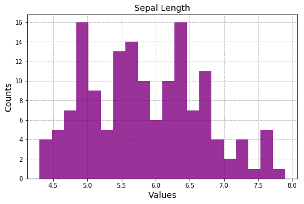


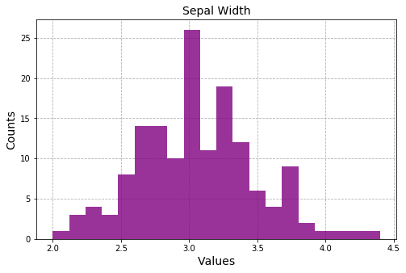


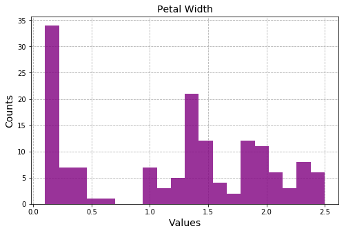


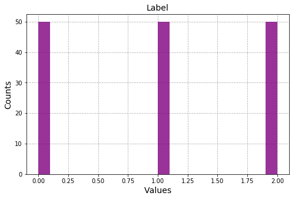


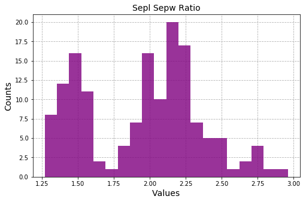


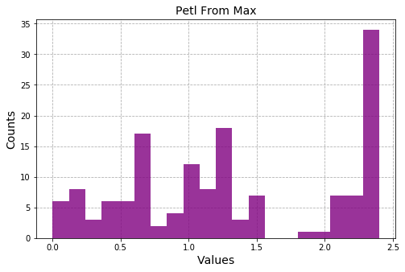


```python
df.head()
```


<div>
<style scoped>
    .dataframe tbody tr th:only-of-type {
        vertical-align: middle;
    }

    .dataframe tbody tr th {
        vertical-align: top;
    }

    .dataframe thead th {
        text-align: right;
    }
</style>
<table border="1" class="dataframe">
  <thead>
    <tr style="text-align: right;">
      <th></th>
      <th>sepal_length</th>
      <th>sepal_width</th>
      <th>petal_length</th>
      <th>petal_width</th>
      <th>label</th>
      <th>sepl_sepw_ratio</th>
      <th>petl_from_max</th>
    </tr>
  </thead>
  <tbody>
    <tr>
      <td>0</td>
      <td>5.1</td>
      <td>3.5</td>
      <td>1.4</td>
      <td>0.2</td>
      <td>0</td>
      <td>1.46</td>
      <td>2.3</td>
    </tr>
    <tr>
      <td>1</td>
      <td>4.9</td>
      <td>3.0</td>
      <td>1.4</td>
      <td>0.2</td>
      <td>0</td>
      <td>1.63</td>
      <td>2.3</td>
    </tr>
    <tr>
      <td>2</td>
      <td>4.7</td>
      <td>3.2</td>
      <td>1.3</td>
      <td>0.2</td>
      <td>0</td>
      <td>1.47</td>
      <td>2.3</td>
    </tr>
    <tr>
      <td>3</td>
      <td>4.6</td>
      <td>3.1</td>
      <td>1.5</td>
      <td>0.2</td>
      <td>0</td>
      <td>1.48</td>
      <td>2.3</td>
    </tr>
    <tr>
      <td>4</td>
      <td>5.0</td>
      <td>3.6</td>
      <td>1.4</td>
      <td>0.2</td>
      <td>0</td>
      <td>1.39</td>
      <td>2.3</td>
    </tr>
  </tbody>
</table>
</div>


```python
# let's get petal lengths only above 2.5

df_petL_greater_2_5 = df.loc[df['petal_length']>2.5]
```


```python
for column in df_petL_greater_2_5.columns:
    plot_hist(df_petL_greater_2_5, column, bins=15)
```


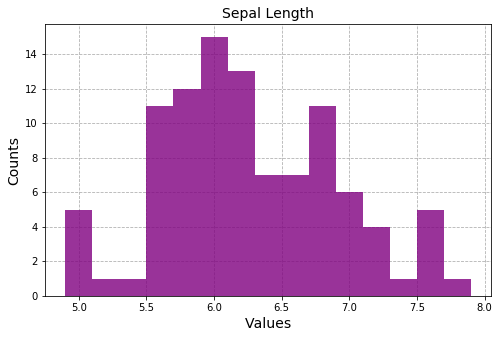


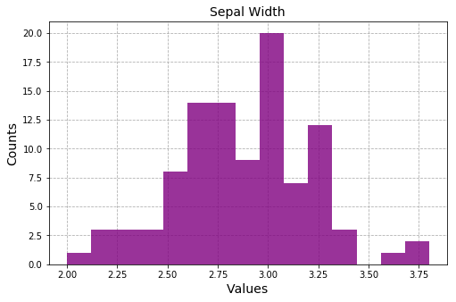


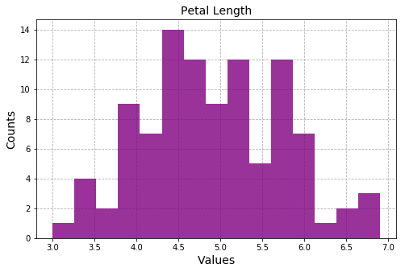


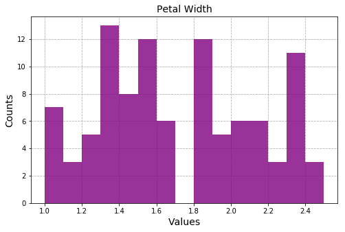


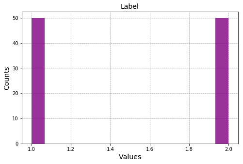


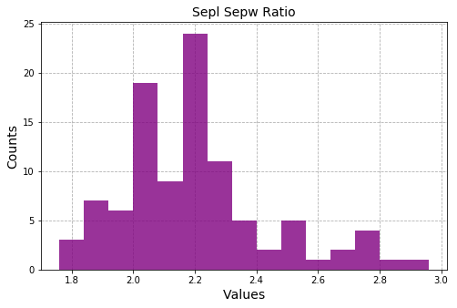


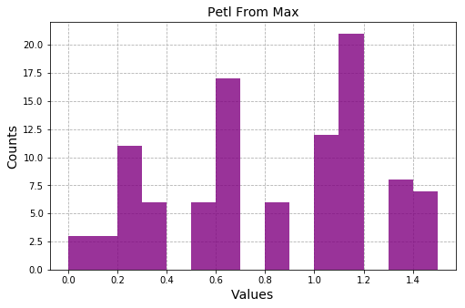


```python
# This is a great first look at your data

pd.plotting.scatter_matrix(df, figsize=(20, 20), s=100, marker='x', hist_kwds={"bins":20})
plt.show()
```


```python
print(iris.DESCR)
```

    .. _iris_dataset:
    
    Iris plants dataset
    --------------------
    
    **Data Set Characteristics:**
    
        :Number of Instances: 150 (50 in each of three classes)
        :Number of Attributes: 4 numeric, predictive attributes and the class
        :Attribute Information:
            - sepal length in cm
            - sepal width in cm
            - petal length in cm
            - petal width in cm
            - class:
                    - Iris-Setosa
                    - Iris-Versicolour
                    - Iris-Virginica
                    
        :Summary Statistics:
    
        ============== ==== ==== ======= ===== ====================
                        Min  Max   Mean    SD   Class Correlation
        ============== ==== ==== ======= ===== ====================
        sepal length:   4.3  7.9   5.84   0.83    0.7826
        sepal width:    2.0  4.4   3.05   0.43   -0.4194
        petal length:   1.0  6.9   3.76   1.76    0.9490  (high!)
        petal width:    0.1  2.5   1.20   0.76    0.9565  (high!)
        ============== ==== ==== ======= ===== ====================
    
        :Missing Attribute Values: None
        :Class Distribution: 33.3% for each of 3 classes.
        :Creator: R.A. Fisher
        :Donor: Michael Marshall (MARSHALL%PLU@io.arc.nasa.gov)
        :Date: July, 1988
    
    The famous Iris database, first used by Sir R.A. Fisher. The dataset is taken
    from Fisher's paper. Note that it's the same as in R, but not as in the UCI
    Machine Learning Repository, which has two wrong data points.
    
    This is perhaps the best known database to be found in the
    pattern recognition literature.  Fisher's paper is a classic in the field and
    is referenced frequently to this day.  (See Duda & Hart, for example.)  The
    data set contains 3 classes of 50 instances each, where each class refers to a
    type of iris plant.  One class is linearly separable from the other 2; the
    latter are NOT linearly separable from each other.
    
    .. topic:: References
    
       - Fisher, R.A. "The use of multiple measurements in taxonomic problems"
         Annual Eugenics, 7, Part II, 179-188 (1936); also in "Contributions to
         Mathematical Statistics" (John Wiley, NY, 1950).
       - Duda, R.O., & Hart, P.E. (1973) Pattern Classification and Scene Analysis.
         (Q327.D83) John Wiley & Sons.  ISBN 0-471-22361-1.  See page 218.
       - Dasarathy, B.V. (1980) "Nosing Around the Neighborhood: A New System
         Structure and Classification Rule for Recognition in Partially Exposed
         Environments".  IEEE Transactions on Pattern Analysis and Machine
         Intelligence, Vol. PAMI-2, No. 1, 67-71.
       - Gates, G.W. (1972) "The Reduced Nearest Neighbor Rule".  IEEE Transactions
         on Information Theory, May 1972, 431-433.
       - See also: 1988 MLC Proceedings, 54-64.  Cheeseman et al"s AUTOCLASS II
         conceptual clustering system finds 3 classes in the data.
       - Many, many more ...


```python
# Let's look a plot of sepal_width vs petal_width colored by label
sns.lmplot(x='sepal_width', y='petal_width', data=df, hue='label', fit_reg=False)
plt.show()
```


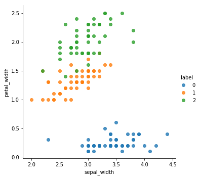


```python
plt.hexbin(df['sepal_width'], df['petal_width'], C=df['petal_length'], gridsize=30)
plt.show()
```


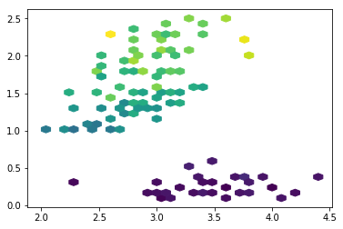


```python
corr = df.corr().abs()
corr
```


<div>
<style scoped>
    .dataframe tbody tr th:only-of-type {
        vertical-align: middle;
    }

    .dataframe tbody tr th {
        vertical-align: top;
    }

    .dataframe thead th {
        text-align: right;
    }
</style>
<table border="1" class="dataframe">
  <thead>
    <tr style="text-align: right;">
      <th></th>
      <th>sepal_length</th>
      <th>sepal_width</th>
      <th>petal_length</th>
      <th>petal_width</th>
      <th>label</th>
      <th>sepl_sepw_ratio</th>
      <th>petl_from_max</th>
    </tr>
  </thead>
  <tbody>
    <tr>
      <td>sepal_length</td>
      <td>1.000000</td>
      <td>0.117570</td>
      <td>0.871754</td>
      <td>0.817941</td>
      <td>0.782561</td>
      <td>0.729862</td>
      <td>0.817941</td>
    </tr>
    <tr>
      <td>sepal_width</td>
      <td>0.117570</td>
      <td>1.000000</td>
      <td>0.428440</td>
      <td>0.366126</td>
      <td>0.426658</td>
      <td>0.748200</td>
      <td>0.366126</td>
    </tr>
    <tr>
      <td>petal_length</td>
      <td>0.871754</td>
      <td>0.428440</td>
      <td>1.000000</td>
      <td>0.962865</td>
      <td>0.949035</td>
      <td>0.837523</td>
      <td>0.962865</td>
    </tr>
    <tr>
      <td>petal_width</td>
      <td>0.817941</td>
      <td>0.366126</td>
      <td>0.962865</td>
      <td>1.000000</td>
      <td>0.956547</td>
      <td>0.753437</td>
      <td>1.000000</td>
    </tr>
    <tr>
      <td>label</td>
      <td>0.782561</td>
      <td>0.426658</td>
      <td>0.949035</td>
      <td>0.956547</td>
      <td>1.000000</td>
      <td>0.777334</td>
      <td>0.956547</td>
    </tr>
    <tr>
      <td>sepl_sepw_ratio</td>
      <td>0.729862</td>
      <td>0.748200</td>
      <td>0.837523</td>
      <td>0.753437</td>
      <td>0.777334</td>
      <td>1.000000</td>
      <td>0.753437</td>
    </tr>
    <tr>
      <td>petl_from_max</td>
      <td>0.817941</td>
      <td>0.366126</td>
      <td>0.962865</td>
      <td>1.000000</td>
      <td>0.956547</td>
      <td>0.753437</td>
      <td>1.000000</td>
    </tr>
  </tbody>
</table>
</div>


```python
corr = df.corr().abs()

plt.figure(figsize=(8, 6))
sns.heatmap(corr, cmap=sns.color_palette('Blues'), annot=True)
plt.show()
```


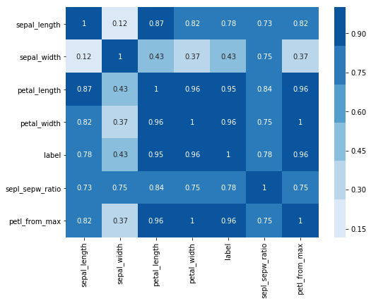


### Assessment
